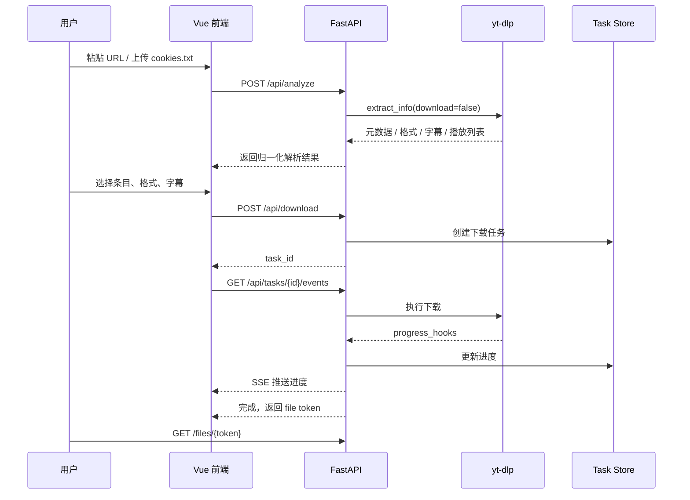

# Download Flow

```mermaid
sequenceDiagram
  participant User as 用户
  participant Vue as Vue 前端
  participant API as FastAPI
  participant Y as yt-dlp
  participant Store as Task Store

  User->>Vue: 粘贴 URL / 上传 cookies.txt
  Vue->>API: POST /api/analyze
  API->>Y: extract_info(download=false)
  Y-->>API: 元数据 / 格式 / 字幕 / 播放列表
  API-->>Vue: 返回归一化解析结果

  User->>Vue: 选择条目、格式、字幕
  Vue->>API: POST /api/download
  API->>Store: 创建下载任务
  API-->>Vue: task_id

  Vue->>API: GET /api/tasks/{id}/events
  API->>Y: 执行下载
  Y-->>API: progress_hooks
  API->>Store: 更新进度
  API-->>Vue: SSE 推送进度

  API-->>Vue: 完成，返回 file token
  User->>API: GET /files/{token}
```

