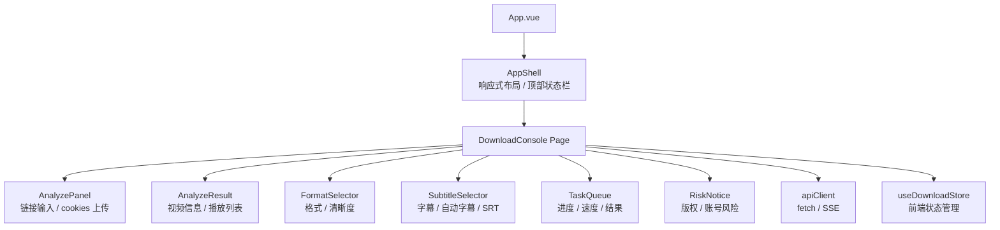

# Frontend Modules

```mermaid
flowchart TB
  App["App.vue"] --> Shell["AppShell<br/>响应式布局 / 顶部状态栏"]
  Shell --> Page["DownloadConsole Page"]

  Page --> Analyze["AnalyzePanel<br/>链接输入 / cookies 上传"]
  Page --> Results["AnalyzeResult<br/>视频信息 / 播放列表"]
  Page --> Format["FormatSelector<br/>格式 / 清晰度"]
  Page --> Subtitle["SubtitleSelector<br/>字幕 / 自动字幕 / SRT"]
  Page --> Queue["TaskQueue<br/>进度 / 速度 / 结果"]
  Page --> Risk["RiskNotice<br/>版权 / 账号风险"]

  Page --> Client["apiClient<br/>fetch / SSE"]
  Page --> Store["useDownloadStore<br/>前端状态管理"]
```

