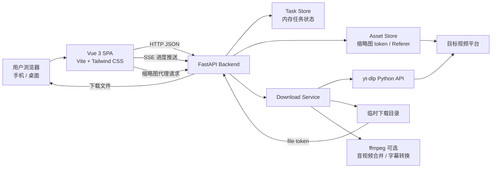

# System Architecture

```mermaid
flowchart LR
  U["用户浏览器<br/>手机 / 桌面"] --> FE["Vue 3 SPA<br/>Vite + Tailwind CSS"]
  FE -->|HTTP JSON| API["FastAPI Backend"]
  FE -->|SSE 进度推送| API
  FE -->|缩略图代理请求| API

  API --> TS["Task Store<br/>内存任务状态"]
  API --> AS["Asset Store<br/>缩略图 token / Referer"]
  API --> DL["Download Service"]
  DL --> YTDLP["yt-dlp Python API"]
  DL --> TMP["临时下载目录"]
  DL --> FF["ffmpeg 可选<br/>音视频合并 / 字幕转换"]

  YTDLP --> WEB["目标视频平台"]
  AS --> WEB
  TMP -->|file token| API
  API -->|下载文件| U
```
