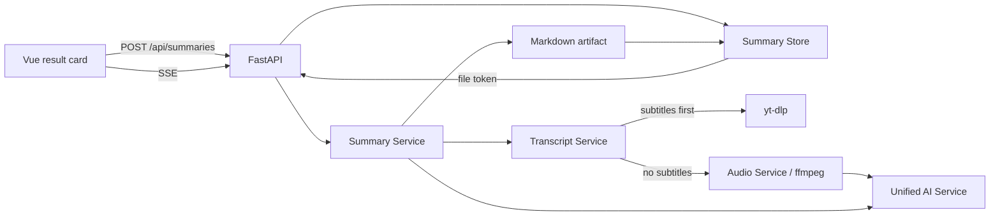

# AI Video Summary Design

## Goal

Add an AI-powered learning summary flow to SaveAny. Users can summarize a parsed public video without watching the full content. The feature must support videos with subtitles and videos without subtitles by falling back to speech-to-text transcription.

## Product Scope

The first version adds an "AI Summary" action next to the existing download action after URL analysis. It produces a structured learning note with:

- One-sentence overview
- Chapter outline
- Core knowledge points
- Timestamped highlights
- Term explanations
- Suggested follow-up questions
- Markdown export

The feature uses a product-owned AI service configured on the backend. Users do not enter provider keys in the browser.

## Recommended Architecture

Use an independent summary task instead of extending the download task. Download tasks remain focused on media download and file delivery. Summary tasks own transcript extraction, speech-to-text fallback, AI summarization, progress updates, result storage, and Markdown export.



## Backend Components

- `summary_store.py`: in-memory summary task state, result storage, and markdown file token mapping.
- `transcript_service.py`: fetches subtitles with `yt-dlp`, parses SRT/VTT text, and reports whether the transcript came from manual subtitles, automatic subtitles, or speech-to-text.
- `audio_service.py`: extracts audio from a video URL or downloaded file with `yt-dlp`/`ffmpeg` so speech-to-text can run when subtitles are unavailable.
- `ai_provider.py`: product-owned OpenAI-compatible HTTP client. Reads `AI_BASE_URL`, `AI_API_KEY`, `AI_TEXT_MODEL`, `AI_TRANSCRIBE_MODEL`, and timeout values from environment variables.
- `summary_service.py`: orchestrates transcript acquisition, speech-to-text fallback, chunked summarization, final structured JSON, and Markdown rendering.

## API Contract

### `POST /api/summaries`

Request:

```json
{
  "url": "https://example.com/watch",
  "title": "Optional title",
  "language": "zh-CN"
}
```

Response:

```json
{
  "summary_id": "summary_abc"
}
```

### `GET /api/summaries/{summary_id}`

Returns a summary snapshot:

```json
{
  "id": "summary_abc",
  "url": "https://example.com/watch",
  "status": "summarizing",
  "stage": "summary",
  "progress": 72,
  "message": "Generating structured summary",
  "result": null,
  "markdown_url": null,
  "error": null
}
```

Statuses: `queued`, `transcribing`, `summarizing`, `completed`, `failed`.

Stages: `queued`, `subtitle`, `speech_to_text`, `summary`, `completed`, `failed`.

### `GET /api/summaries/{summary_id}/events`

SSE stream with event name `summary` and the same snapshot shape as `GET`.

### `GET /api/summaries/{summary_id}/markdown`

Returns the generated Markdown note. Unknown or unfinished summaries return 404.

## Error Handling

- Missing backend AI configuration returns a clear configuration error.
- Subtitle extraction failures do not fail the task immediately; they trigger speech-to-text fallback.
- Speech-to-text failures fail the task with a concise recovery message.
- Provider raw responses and API keys are never logged or returned.
- JSON summary parse failures fall back to a safe Markdown-like text summary shape so the user still receives useful output.

## Frontend Design

Keep the current light SaveAny interface. Add a compact secondary "AI 总结" action in the result card. The summary panel appears below the video result card and includes:

- progress stage text
- source badge: 字幕 / 自动字幕 / 语音转写
- tabs or stacked sections for 大纲, 知识点, 时间轴, 术语, 追问
- Markdown export button after completion

The layout must remain usable at 375px width. The AI panel should feel like a learning note attached to the download workflow, not a separate landing page.

## Testing Strategy

- Unit test summary store task lifecycle and markdown token behavior.
- Unit test SRT/VTT transcript parsing.
- Unit test transcript fallback from subtitles to speech-to-text.
- Unit test AI provider request shaping and response parsing with fake clients.
- API test summary task creation, SSE snapshot shape, success, and failure using fake services.
- Frontend tests for Chinese AI summary copy and API client functions.
- Browser test on localhost with a fake AI summary service path, verifying the AI button, progress state, and rendered summary result.

## Non-Goals

- User accounts, quotas, billing, or database persistence.
- AI chat over the video.
- PDF/Word export.
- Bypassing private, DRM, login-gated, or risk-controlled videos.
- Client-side AI provider configuration.
